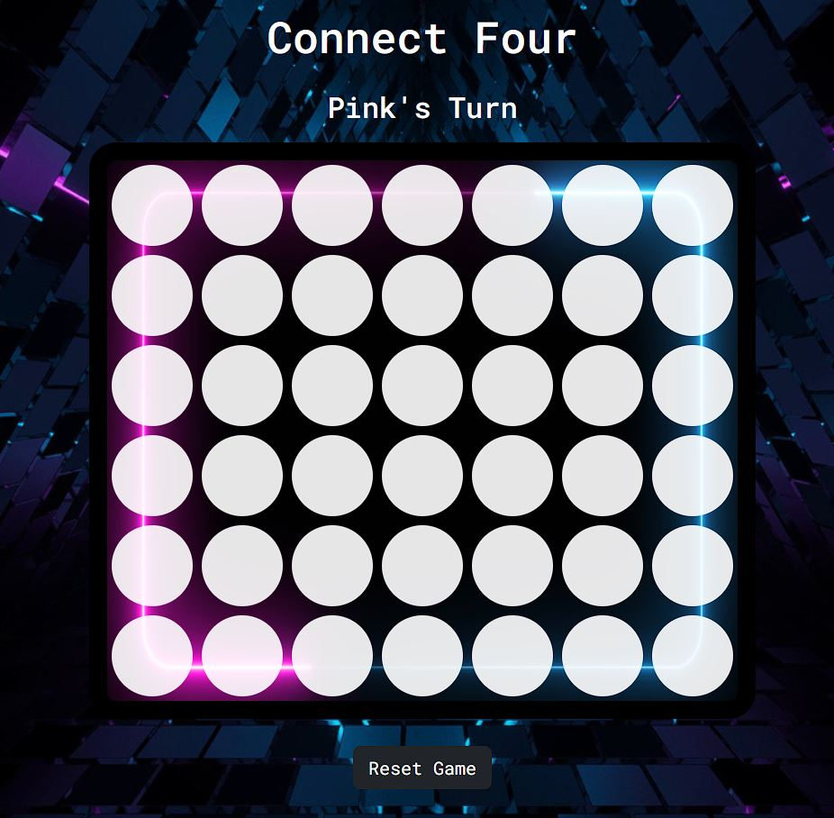
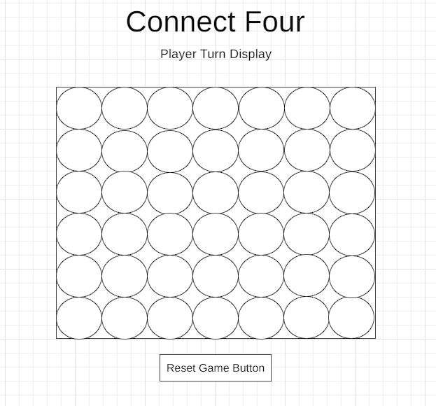
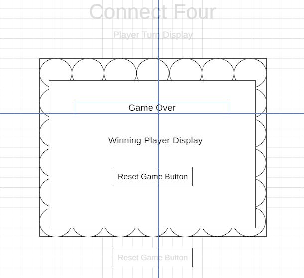

# Connect Four 

 by Scott Edwards

[Click here to view the live website.](https://scotte13.github.io/Connect-Four/)

Developed using HTML, CSS & Javascript for educational purposes as part of the Code Institute diploma in web development.

- - -

# Project Goals

## Purpose

To create a web based connect four game.

## Client Aims

This game was built for myself as a milestone project in Code Institute's web development course. The goal of this project is to utilise and demonstrate skills in interactive web design using the HTML5, CSS3 and Javascript technologies. 

## User Aims

Users of this site should:
- Be able to play a two player game of the traditional [Connect Four](https://en.wikipedia.org/wiki/Connect_Four) game. 
- Intuitivley understand how to use the site to play the game. 
- Be informed of the games result.
- Be able to reset the game at any point or upon completion.

This version of the project assumes the user is aware of the Connect Four game already and of how to play. Players must be using the same device.

## User Stories

This site would be used by someone who wants to play a quick game of Connect Four with a friend and does not have, or wish to use, a physical board. They would want

- To be able to access and play the game on their device.
- To get started quickly and simply.
- To be able to reset the game to play as many times as they wish.
- The game to look good visually.
- The gameplay area to be clearly visible for ease of play.

## Project Scope

The scope of this project was limited to meeting the key project goal of demonstrating interactive web based development using the technologies known. 

Notably internet and device connectivity, so that people could play against someone not physically present, or computer AI development so they could play against the computer, were not within the scope of this project.

Consideration was briefly given to allow the computer to randomly choose a go, but this idea was dismissed as it would not result in a fun or competitive game on it's own. 

The intended scope for the user is therefore playing the game with another person, using the same device. 

- - -

# Design & Structure

## Project Structure

The structure of this project was planned to be a single page only. This was chosen for two reasons.
1) It provides visual simplicity for a user.
2) Any changes needed to the content would instead use javascript DOM manipulation to demonstrate those skills, in accordance with the project goals.

The javascript code would all be contained within one external file.

## Wireframes

Simple wireframes were drawn up using [wireframe.cc](https://wireframe.cc/)

For the main game page: 
  

For the display generated at the end of a game: 
 

## Visual Design

The goal was for the site to look good, while ensuring that the game board remains prominent for ease of play. A dark background image was chosen for this reason. Board spaces would remain white to be easily visible, and the player colours would also need to be bright. This would ensure contrast with the sites background.

The gameboard area uses a seperate background image rather than a plain background color. This was actually an accident while experimenting with background images, however I really liked the result so chose to keep it. 

I personally do not like the traditional connect four colours so wanted to use alternatives. The player colours were chosen later in development to match with coloring present in the background images. The original blue used was a lighter shade like the blue in the background images, however this was a bit difficult to see and differentiate from the empty white spaces. A stronger blue colour was used for this reason. 

Plain white text and a strong google font were chosen. The text color contrasts with the page background so the text is clearly visible, and the simple design is a nice balance to the detailed background image.

## Javascript Game Design

Connect Four games have been built as part of beginner javascript projects before and there are various tutorials available online. I did some research using these as a starting point and there were a number of slightly differing approaches. I need to credit Ania Kubów's video primarily for providing an exceptionally clear overview of the project.

Following this research I decided the method by which I wanted to make my game was by including a javascript array to record the gamestate in real time. 

The primary game design chosen was to use event listeners in the DOM to detect a player clicking on an empty space, and then to place their colour token on to the board in that space. Each space was given a unique ID attribute using javascript starting at 0 and increasing to 41. These ID's would correspond to the same index position within the javascript gamestate array. (See visual below)

    00, 01, 02, 03, 04, 05, 06,
    07, 08, 09, 10, 11, 12, 13,
    14, 15, 16, 17, 18, 19, 20,
    21, 22, 23, 24, 25, 26, 27,
    28, 29, 30, 31, 32, 33, 34,
    35, 36, 37, 38, 39, 40, 41

During gameplay the ID of the space clicked can be retrieved using javascript code and then used to update the corresponding position in the gamestate array. This array can then be searched to determine if there is a winner.

Calculating the winner was the most complex part of the coding. Code to loop through the gamestate array could easily result in false positives. The simplest example of this is a horizontal check. Code can retrieve the values of the data from the gamestate array at an index position and the three following index positions, and check if they are all equal to a value. For example if index positions 00, 01, 02 and 03 are all set to a players number the game has been won. However this same code could also return that a player has won if, for example, 05, 06, 07 and 08 are all equal. This is not correct as they are not actually four in a row on the game board. 

To solve this problem I need to fully credit a youtube video made by Tom Campbell. His solution to this problem is what I implemented. He used a remainder operator to limit the checks the code would make. Each column of the gameboard contains spaces with ID's that increment in seven. For example the first column has ID's of 1, 7, 14, 21, 28, 35. Using the remainder operater when dividing by seven on an index value will always return the same value if the space was in the same column. A column one space would return 0. A column two space would return 1, and so on. 

For the horizontal win check, from left to right, we know that anything in the fith column onwards will move on to the next row and would not actually be a win. We therefore set a condition to run the check, that the index value's remainder when divided by seven is less than four. The code now only checks horizontally for a win using indexes in the initial four columns. 

Similar logic was used to set conditions for the diagnoal checks. 

- - -

### Technologies Used

- HMTL5
- CSS3
- Javascript
- Git
- Git Hub
- Codeanywhere
- Bootstrap 5.3
- Google Fonts

- - -
# Testing

### Validation Checks

- The HMTL was tested using the [W3C Validator](https://validator.w3.org/). The validator returned only one warning which was to state there was an empty heading. This was the h3 heading used within the modal to display the game result. No change needed to be made because this was fully intentional. This element is populated by javascript code when it is needed.

- The CSS style sheet was tested using [W3C Jigsaw Validator](https://jigsaw.w3.org/css-validator) and returned no errors.

- The final javascript code was tested using both the [beautifytools](https://beautifytools.com/javascript-validator.php) and [jshint](https://jshint.com/) validators. No issues were found.

- Javascript validation checks were also made activley during the course of development. One major issue was found which was that a function had been declared within my initial for loop. This had been done to use the current i value, as it looped, as part of the function. This issue was fixed by removing the function from the loop and creating additional variables in the function itself so that it would still work as intended. 

### Manual Checks
- The site has been tested in multiple browsers and works as intended.

- The site has been tested on desktop and mobile directly and works as intended.

- The site has not been tested on a tablet device but I have attempted to emulate this by resizing a browser window. The game works as intended however responsiveness in terms of sizing could be improved for mid-sized devices.

- The game itself was tested extensivley to check that the different win conditions all execute correctly. During this testing some false postivie wins were detected. This was corrected by adding additional conditional checks to the detectWin function to further limit when it would run. 

- The console has been checked during gameplay and there is one error that occurs. "Uncaught TypeError: Cannot read properties of undefined (reading 'classList')"  
This happens when a click is detected on a space in the bottom row only, where the space has already been filled by a player.  
This error is not resolved at present, but it does not impact on the games functionality and is not visible to the user in anyway.

### Bugs 

Bugs during devlopment occured, essentially as expected, during devlopment of the game logic and were fixed as coding continued.

- Players could initially place a piece anywhere.
- Players could initially overwrite another players piece.
- The game would declare wins that were not actually wins. 

There was intitially a visual issue with the sizing of the gameboard and the empty spaces where the spaces were overflowing. My size calculations had not taken into account the size of the border. This was fixed by making slight amendments to the sizing. 

The opposite issue occured later in devlopment when linking to bootstrap. Empty space appeared within the gameboard area on the right. This occured because bootstrap sets the box-sizing attribute to border-box by standard. I again fixed this by making slight amendments to the sizing. In retrospect I should have used the box-sizing attribute initially. 

I encountered an issue with Git during devlopment where I somehow closed a terminal in process and it locked everything up. I was unable to execute basically any git commands due to the presence of a locked file. I tried to fix this by looking up git commands but was unable to find a solution in that way. Eventually I turned to stackoverflow for help and found the same issue and an accompanying solution containing a full command to delete the locked file. I executed this command in the terminal and was then able to continue using Git as normal. 

I am not aware of any remaining bugs in the project gameplay and it is functioning as intended.

- - -

# Credits

- [Ania Kubów's](https://www.youtube.com/watch?v=aroYjgQH8Tw) video used for research and overview of the project.
- [Kenny Yip Coding's](https://www.youtube.com/watch?v=4ARsthVnCTg) video used for research and overview of the project.
- [Tom Campbell's](https://www.youtube.com/watch?v=kA9OOeUXXSU) video. Direct credit for coding solution used to prevent false wins occuring. 
- [w3schools](https://www.w3schools.com/howto/howto_css_modals.asp). Direct credit for modal code.

- [Stackoverflow](https://stackoverflow.com/), [MDN Web Docs](https://developer.mozilla.org/) & [w3schools](https://www.w3schools.com/) for help with general coding syntax.

- Images - https://unsplash.com/  &  https://www.freepik.com/
- Font used - https://fonts.google.com/
- Bootstrap for button styling - https://getbootstrap.com/

- - -

# Deployment

This site was deployed using GitHub pages by taking the following steps:

- From the GitHub repository, go to the settings tab. 
- Select pages from the menu.
- Select the main branch.
- Save

Once completed the url will generate. 

The live URL is: https://scotte13.github.io/Connect-Four/

To clone the repository for your own use you can take the following steps:

-From the GitHub repository select the code drop down button.
- Select HTTPS
- Copy the repository link
- Open your own integrated development environment. 
- enter the git clone command and then paste the copied URL
-"git clone url"